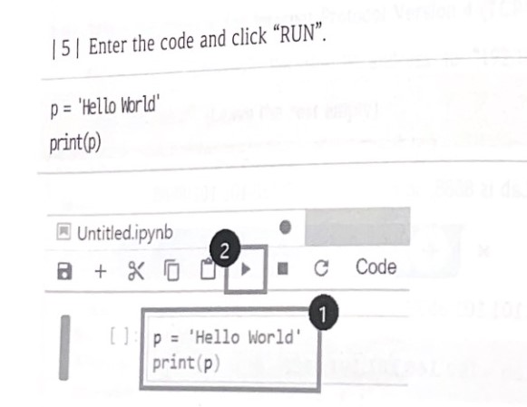
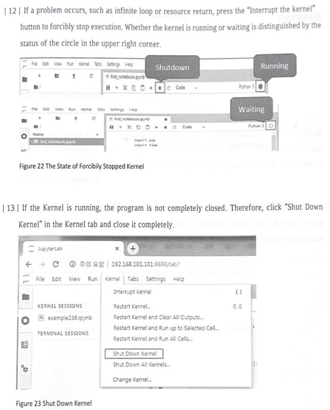

<a id="readme-top"></a>

# Challenge

<p id="demo-video">AIoT Device Manufacturer Demo:</p>

[](https://www.youtube.com/watch?v=aYJOenclUvQ)

<p align="right">(<a href="#readme-top">back to top</a>)</p>

## Info

Inside the [/examples](./examples/) folder you have a couple files demonstrating how to use each sensor, pin and controller.

Check the [/docs/images/code/](./docs/images/code/)
folder for more in-depth code examples.

The [test.py](test.py) contains a partial code example, waiting for you to complete it.

With that information, we challenge you to develop a full system, integrating most of the sensors and controllers, trying to replicate the <a href="#demo-video">demo by the manufacturer</a> and/or the [demo by NOSi](./docs/videos/demo.mp4).

<p align="right">(<a href="#readme-top">back to top</a>)</p>

## Starting to code

First, ensure that both the AIoT device and your computer are connected to the same network. Once connected, identify the IP address assigned to the AIoT device.

After completing these initial steps, you have two options to connect to the device

### Web Browser

- Navigate to the IP provided by the device, using the port `8888`. For example: `192.168.40.185:8888`
- Login with following password: `soda`

This will open a JupyterLab, where you can do your experiments. The first thing to do is to create a Jupyter Notebook and name it something you won't forget.

### Terminal

- Open a terminal window in your machine
- Access the machine via SSH with the IP provided by the device. For example: `ssh soda@192.168.40.185`
- Login with following password: `soda`

After this, you'll need to navigate to where the code lives inside the AIoT device.

```shell
cd Projects/python/notebook
```

Inside this folder you'll need to create either a Python file or a Jupyter Notebook and name it something you won't forget.

<p align="right">(<a href="#readme-top">back to top</a>)</p>

## Testing the code

### Web Browser





### Terminal

If you have connected via the terminal, you'll need to make sure you're inside the folder where the code lives `(Projects/python/notebook)`, and run the following command:

```shell
python <file_name>.py
```

<p align="right">(<a href="#readme-top">back to top</a>)</p>

# **Happy Coding! 😁**
